# ERD — Foundation, Inventory, Master Data, Document Engine, Purchase, Sales & Payment Workflow

Scope: Foundation (Company, Branch, Warehouse, Role, Permission) + Inventory refactor (Item, StockIn, StockLedger) + Sprint 2 Master Data (Customer, Supplier, ItemGroup, UnitOfMeasurement, Currency, Tax) + Sprint 3 Document Engine (NamingSeries, DocumentAttachment, DocumentTimeline, ApprovalFlow) + Sprint 4 Purchase Workflow (PurchaseOrder, PurchaseOrderItem, GoodsReceipt, GoodsReceiptItem, AccountsPayable) + Sprint 5 Sales Workflow (SalesOrder, SalesOrderItem, Delivery, DeliveryItem, AccountsReceivable) + Sprint 6 Financial Settlement (PaymentEntry, PaymentEntryItem, ReceiptEntry, ReceiptEntryItem).

**Sprint 7 added no new tables.** It's a stabilization sprint: bug fixes to existing tables' *behavior* (not schema), one performance migration adding indexes to seven already-existing columns (`accounts_payables.status`, `accounts_receivables.status`, `purchase_orders.order_date`, `sales_orders.order_date`, `goods_receipts.receipt_date`, `deliveries.delivery_date`, `items.current_stock`), and the read-only Dashboard endpoints (pure aggregation queries over the tables already documented below — no `dashboards` table exists). See `docs/DECISIONS.md#d-r31` onward and `docs/INTEGRATION_CHECKLIST.md`.

Every table below also carries `created_by`, `updated_by`, `deleted_by` (FK → `users.id`, nullable), `created_at`, `updated_at`, `deleted_at`. These columns are omitted from the diagram for readability — see [FOUNDATION.md](FOUNDATION.md) for the audit trail mechanism.

```mermaid
erDiagram
    USERS ||--o{ BRANCHES : "has many (via roles, not FK)"
    COMPANIES ||--o{ BRANCHES : "has"
    BRANCHES ||--o{ WAREHOUSES : "has"
    WAREHOUSES ||--o{ STOCK_INS : "receives"
    WAREHOUSES ||--o{ STOCK_LEDGERS : "tracks"
    ITEMS ||--o{ STOCK_INS : "moved by"
    ITEMS ||--o{ STOCK_LEDGERS : "tracked by"
    USERS }o--o{ ROLES : "model_has_roles"
    ROLES }o--o{ PERMISSIONS : "role_has_permissions"
    ITEM_GROUPS ||--o{ ITEMS : "categorizes"
    UOMS ||--o{ ITEMS : "measures"
    DOCUMENT_ATTACHMENTS }o..|| USERS : "uploaded_by"
    APPROVAL_FLOWS }o..o| USERS : "approver_id"
    SUPPLIERS ||--o{ PURCHASE_ORDERS : "sells to"
    PURCHASE_ORDERS ||--o{ PURCHASE_ORDER_ITEMS : "lines"
    ITEMS ||--o{ PURCHASE_ORDER_ITEMS : "ordered as"
    PURCHASE_ORDERS ||--o{ GOODS_RECEIPTS : "received via"
    WAREHOUSES ||--o{ GOODS_RECEIPTS : "receives into"
    GOODS_RECEIPTS ||--o{ GOODS_RECEIPT_ITEMS : "lines"
    PURCHASE_ORDER_ITEMS ||--o{ GOODS_RECEIPT_ITEMS : "fulfilled by"
    GOODS_RECEIPTS ||--o| ACCOUNTS_PAYABLES : "generates"
    SUPPLIERS ||--o{ ACCOUNTS_PAYABLES : "owed to"
    CUSTOMERS ||--o{ SALES_ORDERS : "buys from"
    SALES_ORDERS ||--o{ SALES_ORDER_ITEMS : "lines"
    ITEMS ||--o{ SALES_ORDER_ITEMS : "ordered as"
    SALES_ORDERS ||--o{ DELIVERIES : "delivered via"
    WAREHOUSES ||--o{ DELIVERIES : "ships from"
    DELIVERIES ||--o{ DELIVERY_ITEMS : "lines"
    SALES_ORDER_ITEMS ||--o{ DELIVERY_ITEMS : "fulfilled by"
    DELIVERIES ||--o| ACCOUNTS_RECEIVABLES : "generates"
    CUSTOMERS ||--o{ ACCOUNTS_RECEIVABLES : "owes"
    SUPPLIERS ||--o{ PAYMENT_ENTRIES : "paid via"
    PAYMENT_ENTRIES ||--o{ PAYMENT_ENTRY_ITEMS : "lines"
    ACCOUNTS_PAYABLES ||--o{ PAYMENT_ENTRY_ITEMS : "settled by"
    CUSTOMERS ||--o{ RECEIPT_ENTRIES : "paid via"
    RECEIPT_ENTRIES ||--o{ RECEIPT_ENTRY_ITEMS : "lines"
    ACCOUNTS_RECEIVABLES ||--o{ RECEIPT_ENTRY_ITEMS : "settled by"

    USERS {
        uuid id PK
        string name
        string email UK
        string password
        timestamp email_verified_at
    }

    COMPANIES {
        uuid id PK
        string name
        string code UK
        string currency
        string timezone
        date fiscal_year_start
    }

    BRANCHES {
        uuid id PK
        uuid company_id FK
        string name
        string code UK
        boolean is_head_office
    }

    WAREHOUSES {
        uuid id PK
        uuid branch_id FK
        string name
        string code UK
        string warehouse_type "main|transit|return"
    }

    ROLES {
        uuid id PK
        string name
        string guard_name
    }

    PERMISSIONS {
        uuid id PK
        string name "module.action"
        string guard_name
    }

    ITEMS {
        uuid id PK
        string item_code UK
        string item_name
        uuid item_group_id FK
        uuid uom_id FK
        decimal standard_rate
        int current_stock "cache only, see StockLedger"
    }

    ITEM_GROUPS {
        uuid id PK
        string name UK
        string description
    }

    UOMS {
        uuid id PK
        string name UK
        string symbol
    }

    CURRENCIES {
        uuid id PK
        string code UK
        string name
        string symbol
        decimal exchange_rate "current rate, not time-series"
    }

    TAXES {
        uuid id PK
        string name
        decimal rate "percentage"
        boolean is_active
    }

    CUSTOMERS {
        uuid id PK
        string customer_code UK
        string customer_name
        string phone
        string email
        string address
        boolean is_active
    }

    SUPPLIERS {
        uuid id PK
        string supplier_code UK
        string supplier_name
        string phone
        string email
        string address
        boolean is_active
    }

    STOCK_INS {
        uuid id PK
        uuid item_id FK
        uuid warehouse_id FK
        int qty_in
        date date_in
    }

    STOCK_LEDGERS {
        uuid id PK
        uuid item_id FK
        uuid warehouse_id FK
        string transaction_type "in|out|adjustment"
        string voucher_type "stock_in|..."
        uuid voucher_id "polymorphic, no DB FK"
        string reference_no
        int qty_change "signed"
        int balance_qty "running balance, source of truth"
        datetime posting_datetime
        text remarks
    }

    NAMING_SERIES {
        uuid id PK
        string module
        string document_type
        string prefix
        string suffix
        int digit_length "default 5"
        int current_number "default 0"
        boolean is_default
        boolean is_active
    }

    DOCUMENT_ATTACHMENTS {
        uuid id PK
        string attachable_type "polymorphic"
        uuid attachable_id "polymorphic"
        string disk
        string file_path
        string original_filename
        string extension
        string mime_type
        bigint file_size
        uuid uploaded_by FK
    }

    DOCUMENT_TIMELINES {
        uuid id PK
        string subject_type "polymorphic"
        uuid subject_id "polymorphic"
        string action "created|submitted|cancelled|..."
        text description
        json properties
    }

    APPROVAL_FLOWS {
        uuid id PK
        string approvable_type "polymorphic"
        uuid approvable_id "polymorphic"
        uuid approver_id FK
        string status "pending|approved|rejected"
        int step "default 1"
        text remarks
        datetime decided_at
    }

    PURCHASE_ORDERS {
        uuid id PK
        string document_number UK
        string status "draft|submitted|cancelled"
        int revision
        uuid supplier_id FK
        date order_date
        date expected_delivery_date
        decimal total_amount "cache, sum of items"
        text remarks
        datetime submitted_at
        datetime cancelled_at
    }

    PURCHASE_ORDER_ITEMS {
        uuid id PK
        uuid purchase_order_id FK
        uuid item_id FK
        int qty
        decimal rate
        decimal amount
        int received_qty "default 0, advanced by GoodsReceiptService"
    }

    GOODS_RECEIPTS {
        uuid id PK
        string document_number UK
        string status "draft|submitted|cancelled (cancel forbidden, see notes)"
        int revision
        uuid purchase_order_id FK
        uuid supplier_id FK "denormalized from PO"
        uuid warehouse_id FK
        date receipt_date
        date due_date "manual input, feeds AccountsPayable"
        text remarks
        datetime submitted_at
        datetime cancelled_at
    }

    GOODS_RECEIPT_ITEMS {
        uuid id PK
        uuid goods_receipt_id FK
        uuid purchase_order_item_id FK
        uuid item_id FK
        string item_code "snapshot"
        string item_name "snapshot"
        string uom "snapshot"
        int qty "qty received on this receipt, not cumulative"
        decimal rate "snapshot from PurchaseOrderItem"
        decimal amount
    }

    ACCOUNTS_PAYABLES {
        uuid id PK
        uuid supplier_id FK
        uuid purchase_order_id FK
        uuid goods_receipt_id FK
        string reference_number "snapshot of GoodsReceipt.document_number"
        decimal amount
        decimal paid_amount "advanced by AccountsPayableService::settle(), Sprint 6"
        date due_date
        string status "unpaid|partially_paid|paid — driven by SettlementStatus"
    }

    SALES_ORDERS {
        uuid id PK
        string document_number UK
        string status "draft|submitted|cancelled"
        int revision
        uuid customer_id FK
        date order_date
        date expected_delivery_date
        decimal total_amount "cache, sum of items"
        text remarks
        datetime submitted_at
        datetime cancelled_at
    }

    SALES_ORDER_ITEMS {
        uuid id PK
        uuid sales_order_id FK
        uuid item_id FK
        int qty
        decimal rate
        decimal amount
        int delivered_qty "default 0, advanced by DeliveryService"
    }

    DELIVERIES {
        uuid id PK
        string document_number UK
        string status "draft|submitted|cancelled (cancel forbidden, see notes)"
        int revision
        uuid sales_order_id FK
        uuid customer_id FK "denormalized from SO"
        uuid warehouse_id FK "source warehouse, stock ships from here"
        date delivery_date
        date due_date "manual input, feeds AccountsReceivable"
        text remarks
        datetime submitted_at
        datetime cancelled_at
    }

    DELIVERY_ITEMS {
        uuid id PK
        uuid delivery_id FK
        uuid sales_order_item_id FK
        uuid item_id FK
        string item_code "snapshot"
        string item_name "snapshot"
        string uom "snapshot"
        decimal rate "snapshot from SalesOrderItem"
        int qty "qty delivered on this delivery, not cumulative"
        decimal amount
    }

    ACCOUNTS_RECEIVABLES {
        uuid id PK
        uuid customer_id FK
        uuid sales_order_id FK
        uuid delivery_id FK
        string reference_number "snapshot of Delivery.document_number"
        decimal amount
        decimal paid_amount "advanced by AccountsReceivableService::settle(), Sprint 6"
        date due_date
        string status "unpaid|partially_paid|paid — driven by SettlementStatus"
    }

    PAYMENT_ENTRIES {
        uuid id PK
        string document_number UK
        string status "draft|submitted|cancelled (cancel forbidden, see notes)"
        int revision
        uuid supplier_id FK
        date payment_date
        string payment_method "cash|bank_transfer|cheque"
        string reference_number "external ref, e.g. bank transfer no. — user input, not a snapshot"
        text remarks
        decimal total_amount "cache, sum of items"
        datetime submitted_at
        datetime cancelled_at
    }

    PAYMENT_ENTRY_ITEMS {
        uuid id PK
        uuid payment_entry_id FK
        uuid accounts_payable_id FK
        decimal paid_amount "must be > 0 and <= AP outstanding at submit time"
    }

    RECEIPT_ENTRIES {
        uuid id PK
        string document_number UK
        string status "draft|submitted|cancelled (cancel forbidden, see notes)"
        int revision
        uuid customer_id FK
        date receipt_date
        string payment_method "cash|bank_transfer|cheque"
        string reference_number "external ref — user input, not a snapshot"
        text remarks
        decimal total_amount "cache, sum of items"
        datetime submitted_at
        datetime cancelled_at
    }

    RECEIPT_ENTRY_ITEMS {
        uuid id PK
        uuid receipt_entry_id FK
        uuid accounts_receivable_id FK
        decimal received_amount "must be > 0 and <= AR outstanding at submit time"
    }
```

## Notes

- `STOCK_LEDGERS.voucher_id` is a polymorphic pointer (paired with `voucher_type`) to whichever transaction created the entry. It has no database-level foreign key because the referenced table varies by `voucher_type` — this is the same trade-off ERPNext's Stock Ledger Entry makes.
- `ITEMS.current_stock` is written **only** by `StockLedgerService`, never directly by a controller/request. It represents the item's total on-hand quantity **across every warehouse**, computed as the sum of each warehouse's latest `StockLedger` balance for that item. This note originally claimed "summed" before the code actually did that — Sprint 1 through 6 only ever wrote the *single* warehouse's balance from whichever transaction ran last, silently wrong for any item stocked in more than one warehouse. Fixed in Sprint 7; see [DECISIONS.md](DECISIONS.md#d-r31).
- `spatie/laravel-permission` pivot tables (`model_has_roles`, `model_has_permissions`, `role_has_permissions`) are intentionally excluded from the audit-trail/soft-delete rule — they are pure pivots with composite keys, not standalone entities. See [DECISIONS.md](DECISIONS.md#d-r03).
- `ITEM_GROUPS` is flat (no parent/child tree) and `CURRENCIES.exchange_rate` is a single current value (no historical rate log) — both simplified from ERPNext's equivalents. See [DECISIONS.md](DECISIONS.md#d-r11) and [DECISIONS.md](DECISIONS.md#d-r04).
- `CUSTOMERS` and `SUPPLIERS` were standalone masters as of Sprint 2; as of Sprint 4/5 both are referenced by real transactions (`PURCHASE_ORDERS.supplier_id`, `SALES_ORDERS.customer_id`).
- `DOCUMENT_ATTACHMENTS.attachable_*`, `APPROVAL_FLOWS.approvable_*` remain generic polymorphic pairs (`uuidMorphs`) with no live consumer yet — no upload/approval flow has been wired into Purchase or Sales this round. `DOCUMENT_TIMELINES.subject_*` **does** have real consumers now: every `PurchaseOrder`/`GoodsReceipt`/`SalesOrder`/`Delivery` writes timeline rows automatically via `Documentable` (`created`/`submitted`/`cancelled`). See [DOCUMENT_ENGINE.md](DOCUMENT_ENGINE.md).
- `APPROVAL_FLOWS` is schema only — no service/controller/route reads or writes it yet. See [DECISIONS.md](DECISIONS.md#d-r15).
- `GOODS_RECEIPTS.status` can reach `cancelled` in the enum's type, but `GoodsReceipt::cancel()` is overridden to always throw — the value is structurally possible, never actually reachable this sprint. See [PURCHASE_WORKFLOW.md](PURCHASE_WORKFLOW.md).
- `GOODS_RECEIPT_ITEMS` snapshots `item_code`/`item_name`/`uom` instead of relying solely on the live `Item`/`itemGroup`/`uom` relations, so a historical receipt still reads correctly even if the Item master is renamed or re-categorized later.
- `PURCHASE_ORDER_ITEMS.received_qty` is the only place partial fulfillment is tracked — there is no separate "PO fulfillment status" column; `is_fully_received` is computed in `PurchaseOrderResource`, not stored.
- `DELIVERIES.status` mirrors `GOODS_RECEIPTS.status`: `cancelled` is structurally possible but never reachable — `Delivery::cancel()` always throws, identical rationale to Sprint 4. See [SALES_WORKFLOW.md](SALES_WORKFLOW.md).
- `SALES_ORDER_ITEMS.delivered_qty` mirrors `PURCHASE_ORDER_ITEMS.received_qty` exactly; `is_fully_delivered` is computed in `SalesOrderResource`, not stored.
- `DELIVERY_ITEMS.rate` snapshots `SalesOrderItem.rate` (the price actually agreed at order time), not `Item.standard_rate` — the same snapshot discipline as `GOODS_RECEIPT_ITEMS`, now also covering price, not just descriptive fields.
- `PAYMENT_ENTRIES.status`/`RECEIPT_ENTRIES.status` mirror `GOODS_RECEIPTS.status`/`DELIVERIES.status`: `cancelled` is structurally possible but never reachable — both override `cancel()` to always throw, same rationale as Sprint 4/5 (a submitted settlement has already reduced an AP/AR balance; reversing it needs a dedicated void workflow that doesn't exist yet). See [PAYMENT_WORKFLOW.md](PAYMENT_WORKFLOW.md).
- `PAYMENT_ENTRIES.reference_number`/`RECEIPT_ENTRIES.reference_number` are **user-entered** external references (e.g. a bank transfer or cheque number) — unlike `ACCOUNTS_PAYABLES.reference_number`/`ACCOUNTS_RECEIVABLES.reference_number`, which are system-generated snapshots of an originating document's `document_number`. Same column name, different origin — don't confuse the two.
- `ACCOUNTS_PAYABLES.status`/`ACCOUNTS_RECEIVABLES.status` are computed by the shared `App\Support\SettlementStatus::resolve()` helper (pure function: `amount` vs cumulative `paid_amount` → Unpaid/PartiallyPaid/Paid), called from each side's own `AccountsPayableStatus`/`AccountsReceivableStatus` enum context — one calculation, two enum types. See [DECISIONS.md](DECISIONS.md#d-r23).
- A single `PAYMENT_ENTRIES`/`RECEIPT_ENTRIES` row cannot reference the same `ACCOUNTS_PAYABLES`/`ACCOUNTS_RECEIVABLES` row twice in its items — enforced in the Service, not the schema (no natural DB-level composite-unique fits here since soft-deleted rows would otherwise block re-use).
